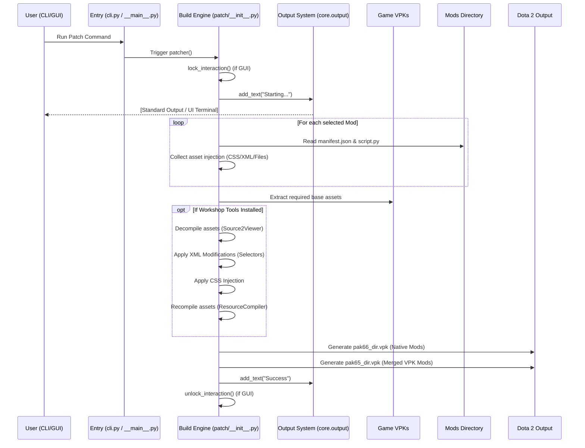
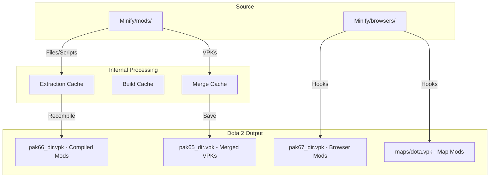

# Architecture of Dota2 Minify

How the pieces fit together: the component layout, the patch pipeline, and the modding hooks that make Minify tick.

## High-Level Overview

`dota2-minify` is built using a **Modular Hook-based Architecture**. The system is designed to be extensible, allowing for "native" mods (simple file/script additions) and "browser" mods (complex third-party integrations) to coexist within the same build pipeline.

### Core Philosophy

1. **Non-Destructive Patching**: Minify never modifies base game files (aside from some text and configuration files) directly. It creates side-loaded VPKs (`pak66_dir.vpk`, etc.) and instructs Steam to load them.
2. **Programmatic Modding**: Mods can contain Python scripts that run at various stages of the build process.
3. **UI-Agnostic Backend**: Backend operations are decoupled from the UI. They communicate through an agnostic output system (`core.output`), allowing the tool to run in both GUI and CLI (Headless) modes.

---

## System Components

### 1. GUI Layer (pywebview + Svelte)

The UI is managed primarily in `Minify/ui/`. It is a consumer of the backend logic and serves as one of the possible interfaces.

- **`web_window.py`**: pywebview window creation, JS API binding, and dark title bar styling.
- **`actions.py`**: All JS-facing API methods, each wrapped with the `@_api_call` error envelope.
- **`output_bridge.py`**: Bridges `core/output.py` to the JS window, buffering messages before the window is ready.
- **`dialogs.py`**: Native file/folder dialogs used by mod scripts and the frontend.
- **`fonts.py`**: Registers the web frontend's font assets.
- **`localization.py`**: JSON-based i18n loading (key-value pairs with locale keys).
- **`announcements.py`**: Timestamp-based announcement system.
- **`modal_shared.py`**: Blocking modal system (`threading.Event` + JS callbacks).
- **`modals.py`**: Implementations of specific modals (Uninstall, Announcements, Update dialogs).
- **`web/`**: Svelte 5 frontend source (`App.svelte`, `src/lib/api.ts`, `src/lib/stores/`, `src/lib/components/`).

### 2. CLI Layer (Headless)

Managed in `Minify/cli.py`. It provides a standard command-line interface for patching, uninstallation, and mod management without requiring a display or GUI libraries.

### 3. Core Engine

Fundamental utilities used by both the UI and the Build pipeline.

- **`core/fs.py`**: Specialized file system operations (atomic moves, safe deletions, recursive creation).
- **`core/steam.py`**: Handles Steam library detection, game path resolution, and launch option patching.
- **`core/net.py`**: Thin `requests` wrapper with offline-simulation support for tests and dev runs.
- **`core/migrations.py`**: One-shot legacy migrations (e.g. `modcfg.json` → `manifest.json`, `xml_mod.json` → `xml.json`).
- **`core/output.py`**: The communication backbone. It provides an agnostic interface for logging and user feedback, supporting multiple callbacks (e.g., standard print for CLI, and the output bridge for the JS GUI).
- **`patch/vpk_utils.py`**: High-level wrapper for `vpk` operations, including metadata generation (`minify_version.txt`).

### 4. Build Pipeline

The `Minify/patch/` package contains the "Patch" engine. It follows a strictly ordered pipeline.

Updates are handled in `ui/modals.py`: the app polls the GitHub releases API, picks the asset matching the current platform (`-windows.zip`, `-linux.zip`, `-macos.zip`, or the `.exe` installer), downloads it, and either launches the installer or extracts alongside the app.

---

## Workflows

### Patching Pipeline

The following diagram illustrates the lifecycle of a patch operation:

### Directory Relationship

The relationship between the source files and the final output:

---

## Modding Architecture

Mods are identified by the presence of a folder in `Minify/mods/`. The system scans these folders and interprets them based on their contents:

- **`manifest.json`**: Metadata and UI configuration.
- **`notes.md`**: Localized descriptions shown in the mod panel.
- **`files/`**: Static assets copied directly into the output VPK.
- **`files_uncompiled/`**: Raw assets (XML/CSS) that require the `resourcecompiler`.
- **`script_*.py`**: Python hooks that run at specific stages (initial, after_patch, etc.).

### Hook Lifecycle

Not every hook runs for every mod — they're all optional. The stage names come from the file names:

1. **`script_initial.py`**: Runs on app startup for every enabled mod.
2. **`script.py`**: Runs during the collection phase of the patcher.
3. **`script_after_decompile.py`**: Runs after `Source2Viewer` has extracted and decompiled assets.
4. **`script_after_recompile.py`**: Runs after `ResourceCompiler` has recompiled the assets.
5. **`script_after_patch.py`**: Runs after the VPK has been saved and cleaned up.
6. **`script_prelaunch.py`**: Runs right before the game is launched.
7. **`script_uninstall.py`**: Runs when the user triggers uninstallation.

Two more hooks are invoked on demand rather than in the bulk loop:

- **`script_setup.py`**: Runs when the mod's settings are first collected (the setup flow), typically to prompt the user for config.
- **`script_utility.py`**: Loaded on demand via `helper.exec_script_function()`, usually to back `function`-type settings (buttons).

---

## Browser System

The Browser system (found in `Minify/browsers/`) allows for complex integrations.

- **UI Integration**: Browsers provide custom UI components (D2PFX ships its own browser tab and mod detail views).
- **Build Hooks**: Browsers implement a build hook (`build_hook.py`) that is called during the patching process, allowing them to perform specialized VPK merging or asset manipulation (as seen in `d2pfx/build_hook.py`).
